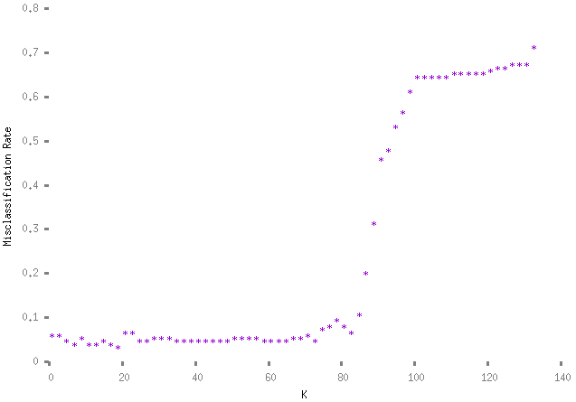

The K nearest neighbors (KNN) classifier is a highly useful and popular tool for applications of data mining. KNN is a relatively simple, supervised machine learning algorithm that classifies vector data points, each of which stores data and a classification, by computing the distance between an input vector and all other vectors. Upon examining all vectors in the dataset, KNN determines the plurality class of the K nearest vectors and assigns this ideal classification to the input vector. In KNN, distance can be measured using various $L^\mathcal{p}$ norms such as the Manhattan distance formula, the Chebyshev distance formula, and most commonly, the Euclidean distance formula which is given by: \\[ d(p,q) = \sqrt{\sum_{i=1}^n (q_i - p_i)^2} \\]
Therefore, using C++ and the Eigen linear algebra library, we can write:
```cpp
#include <cmath>
#include "eigen3/Eigen/Dense"
#include "eigen3/Eigen/StdVector"

double EuclideanDistance(Eigen::VectorXd a, Eigen::VectorXd b, int length)
{

    /* Returns the Euclidean Distance between two vectors of the same feature length, a and b. */

    double sum = 0;

    for(int i = 0; i < length; i++)
    {
        sum += pow(a.coeff(i) - b.coeff(i),2);
    }

    return sqrt(sum);
}
```
Next, in order to draw more accurate predictions than those one might come to by using an arbitrary K value, running N-fold cross-validation on different values of K and comparing the results in can be used to compute the K with the smallest error value. This will be the K that best fits the data. In other words, for each K value from KNN, one should split the data into N folds of data. Then, for N runs, assign one of these folds to be the test/validation data and the rest of the N-1 folds to be the training data, alternating the test/validation data on each run so that every fold will serve as the validation data once. For each of these tests, run KNN on all of the training folds, using the validation data as input. Then calculate the misclassification rate for each train fold output on the sealed validation fold. Averaging these misclassification rates give the misclassification rate for the K value tested in this run of N-fold cross-validation. Miscalculation rate can be computed with:
\\[ \text{Misclassification Rate} = \frac{1}{N} \sum_{n} I (\hat{t}_n \neq t_n) \\]
where $\hat{t}_n$ represents the classifier's output for a training point $n$, and $I(A)$ returns $1$ if $A$ is true and $0$ if $A$ is false. Whichever K value has the least average misclassification rate across N folds is the ideal K. This K is the one that should be used when adding a new vector to assign a classification. \
\
Hence, to compute the misclassification rate, we can write:
```cpp
#include <vector>
#include <algorithm>

double misclassification_rate(std::vector<int> labels, std::vector<int> ground_truth_labels)
{

  /* Takes an array of labels and an array of ground truth labels and calculates the misclassification rate. */

  int incorrect = 0;

  std::vector<int>::iterator labels_it = labels.begin();
  std::vector<int>::iterator ground_truth_labels_it = ground_truth_labels.begin();

  for(; labels_it != labels.end() && ground_truth_labels_it != ground_truth_labels.end(); ++labels_it, ++ground_truth_labels_it)
  {
      if(*labels_it != *ground_truth_labels_it)
      {
        incorrect += 1;
      }
  }

  return (double) incorrect / labels.size();
}
```
<!--KNN is commonly applied in many settings, especially in medical research. For instance, KNN can be used to classify malignant cancer cells based on cell data including cell measurements in a dataset available freely from the UCI Maching Learning Repository. \
\-->
For example, utilizing the 1936 Iris dataset which contains 150 flowers classified by species and their respective sepal and petal measurements, for $K = 1$ to $K = 135$, cross validation computed the following misclassification rates:

choosing $K = 19$ as the optimal value for minimizing the misclassification rate across folds. \
\
Full code for implementation available at: <a style="color: #f56a6a; !important" href="https://github.com/nathanenglehart/knn-cpp-241">https://github.com/nathanenglehart/knn-cpp-241</a>.

### References

Fisher, R.A. (1988). UCI Machine Learning Repository <a style="color: #f56a6a; !important" href="https://archive.ics.uci.edu/ml/datasets/iris">https://archive.ics.uci.edu/ml/datasets/iris</a>. Irvine, CA: University of California, School of Information and Computer Science.
